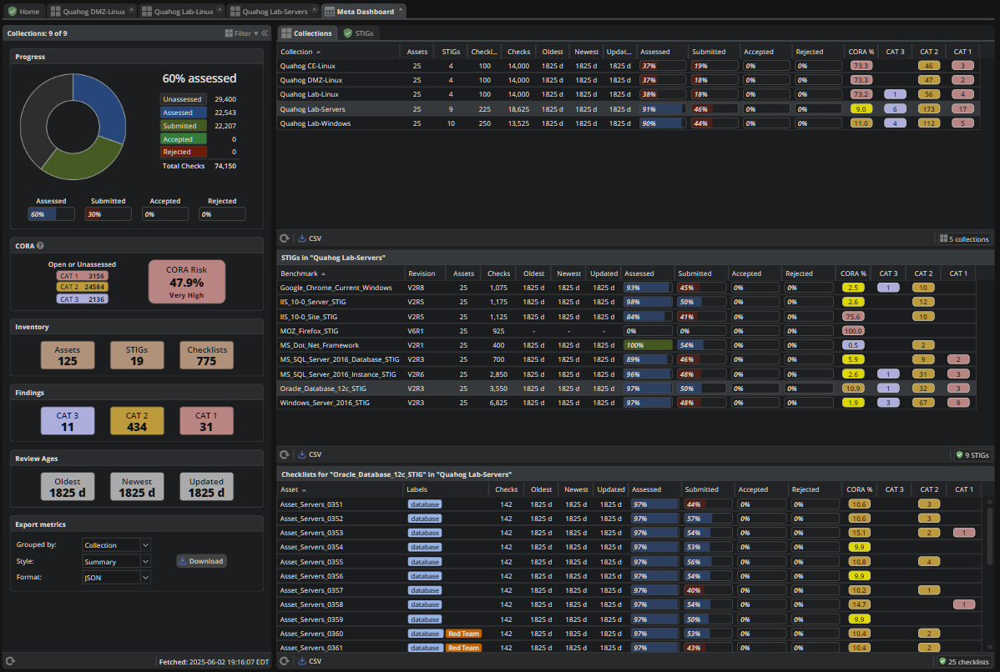

# STIG Manager

STIG Manager is an API and web client for managing STIG assessments of Information Systems, sponsored by the [NAVSEA Warfare Centers](https://www.navsea.navy.mil/Home/Warfare-Centers/). The application presents a unified view of STIG compliance drawn from manual reviews in the web app, file imports (.ckl/.cklb/XCCDF), or automated integrations via the API. STIG Manager supports DISA [Security Technical Implementation Guides (STIGs)](https://public.cyber.mil/stigs/) and Security Requirements Guides (SRGs).

## Who It's For

If you need to track STIG evaluation status across multiple assets, STIGs, or systems, this tool addresses the challenges of managing assessment data that would otherwise be scattered across individual checklist files or spreadsheets.

System administrators can record compliance status in real-time as they harden systems, and scan results from external tools can flow in automatically via the API, providing ISSOs and security managers with live visibility into assessment progress. Working from a shared data set ensures all users maintain a consistent view of compliance status.

## Key Capabilities

- **Collection-Based Organization**: Group Assets, STIGs, and Reviews into Collections that align with your RMF packages or organizational structure; use customizable Labels to categorize Assets and filter views.
- **Progress Tracking and Metrics**: Real-time dashboards showing assessment completion rates, findings by severity, CORA risk scoring, and status tracking.
- **Multi-Source Review Integration**: Combine manual evaluations with imported scan results (XCCDF) and checklists (CKL) in a unified data management interface.
- **Intelligent STIG Revision Management**: When DISA releases new STIG versions, only Rules with changed check content require re-evaluation. Existing reviews are automatically matched to updated Rules where appropriate.
- **Bulk Operations**: Evaluate the same Rule across multiple Assets simultaneously in the Collection Review workspace, apply batch updates, and import/export entire Collections.
- **Collaborative Workflows**: Role-based access controls, Accept/Reject review validation, and configurable review requirements per Collection.
- **API-First Architecture**: Complete REST API (OpenAPI 3.0.1) enables integration with automated scanning tools and custom workflows. The API-first architecture allows custom or third-party clients to interact with assessment data. 

## Screenshots

### Collection Dashboard
*Real-time metrics showing assessment completion, findings by severity, and CORA risk scoring*

### Asset Review Workspace
*Assessment interface with Rule details, CCI/Control mappings, and reference to previous assessments on similar Assets*

### Collection Review Workspace
*Evaluate the same STIG Rule across all Assets in a Collection, with color-coded status and the ability to apply bulk updates*

### Meta-Collection Dashboard
*Aggregate metrics across all Collections you have access to, providing organization-wide visibility into assessment status*

## Role in RMF Workflows

STIG Manager primarily supports **RMF Steps 3 (Implement Security Controls)** and **4 (Assess Security Controls)** by serving as the authoritative reference for current STIG assessment status. During **Step 6 (Monitor Security Controls)**, it tracks review ages, maintains assessment history, and identifies what requires re-evaluation when STIGs update or systems change.

The tool fits within existing processes that typically involve eMASS (or similar RMF platforms), SCAP compliance scanners, and other security tools. STIG Manager does not replace these systems—it specializes in STIG assessment tracking and can import results from scanning tools, export checklists for package submission, and support custom automation via its API.

## Getting Started

- [User Walkthrough](https://stig-manager.readthedocs.io/en/latest/user-guide/user-quickstart.html) - Learn the core workflows for security analysts
- [Admin Walkthrough](https://stig-manager.readthedocs.io/en/latest/admin-guide/admin-quickstart.html) - Setup and Collection management for Application Managers
- [Installation Guide](https://stig-manager.readthedocs.io/en/latest/installation-and-setup/installation-and-setup.html) - Deployment instructions and configuration
- [Environment Variables Reference](https://stig-manager.readthedocs.io/en/latest/installation-and-setup/environment-variables.html)

## Deployment Options

**Containerized (Recommended):**
- Official [Docker images](https://hub.docker.com/r/nuwcdivnpt/stig-manager) available on Docker Hub and DoD Iron Bank
  - Quick-start Docker Compose orchestration includes all dependencies (Keycloak, MySQL)
- [Reference orchestration with CAC/PKI authentication](https://github.com/NUWCDIVNPT/stigman-orchestration) demonstrates nginx reverse proxy integration
  - Supports Kubernetes, OpenShift, or any OCI-compliant container runtime

**Direct Deployment:**
- Run from source using Node.js LTS
- Pre-compiled binaries for Windows/Linux/macOS (no Node.js required)

**Infrastructure Requirements:**
- OpenID Connect (OIDC) provider for authentication (Keycloak, Okta, Azure Entra ID, and F5 tested)
- MySQL 8.4+ database
- Optional reverse proxy for CAC/PKI authentication

The application is stateless and can scale horizontally. Configuration is managed entirely through environment variables.

## Documentation and Resources

The [STIG Manager documentation](https://stig-manager.readthedocs.io/en/latest/index.html) includes User and Setup Guides, video tutorials, terminology references, and deployment scenarios.

- [YouTube Channel](https://www.youtube.com/@stig-manager) - Video tutorials and feature demonstrations
- [Release Notes](https://github.com/NUWCDIVNPT/stig-manager/releases) - Version history
- [Contribution Guide](CONTRIBUTING.md) - DCO requirements and development setup

## Related Resources

**[STIGMan Watcher](https://github.com/NUWCDIVNPT/stigman-watcher)** - A command-line utility that monitors filesystem directories and automatically imports .ckl/.cklb checklists and XCCDF scan results into STIG Manager. Useful for automated workflows and continuous integration with scanning tools.

**[Reference orchestration with CAC/PKI authentication](https://github.com/NUWCDIVNPT/stigman-orchestration)** - A sample Docker Compose setup that includes nginx configured for CAC/PKI authentication in front of STIG Manager and Keycloak.

**[C-PAT](https://github.com/NSWC-Crane/C-PAT)** - The Crane POA&M Automation Tool, developed by NSWC Crane, integrates with STIG Manager's API to automate vulnerability documentation and POA&M tracking throughout the RMF process.

## Sponsor

STIG Manager is sponsored by the [NAVSEA Warfare Centers](https://www.navsea.navy.mil/Home/Warfare-Centers/). While its primary goal is to support NAVSEA compliance processes, the tool is designed to be flexible and adaptable to other workflows. This project follows [Code.mil](https://code.mil) [guidance](https://github.com/Code-dot-mil/code.mil) for open source software released by the U.S. Department of Defense.

For inquiries, contact the RMF Tools team at RMF_Tools@us.navy.mil.