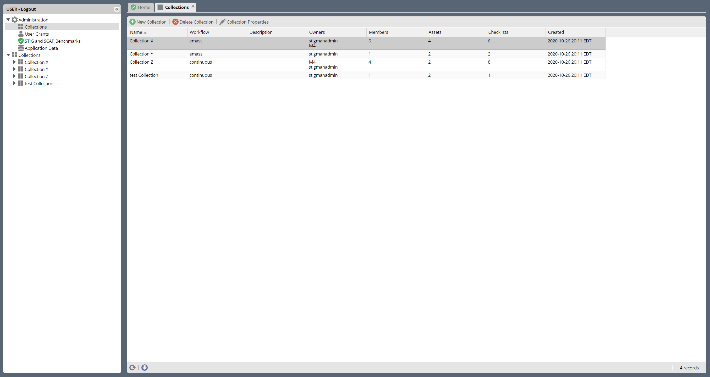
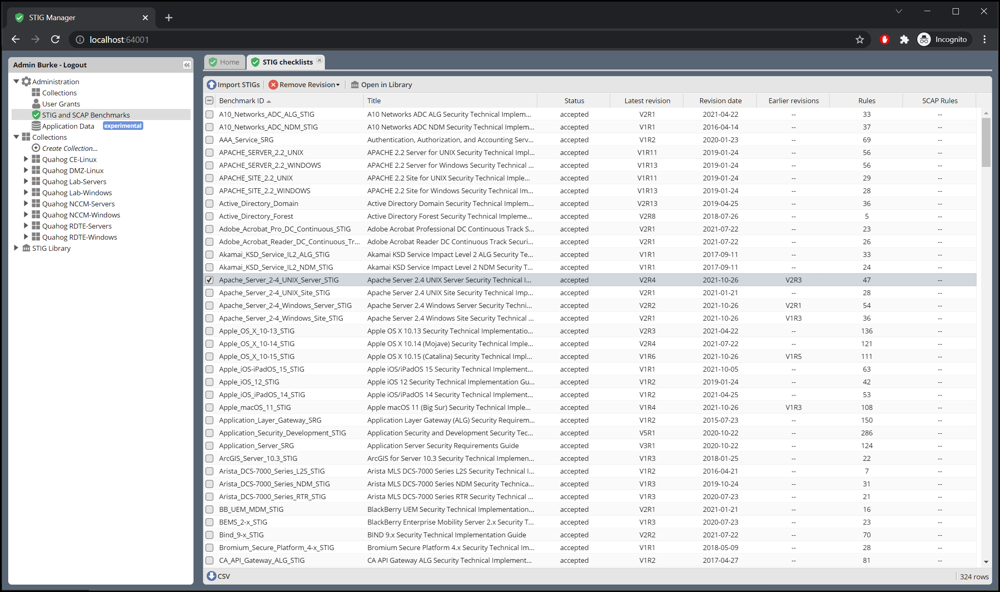

# STIG Manager Admin Guide

This Admin Guide will walk you through typical responsibilities for a STIG Manager Administrator User.
Beyond the permissions granted to normal Users, Administrators have the ability to:
   * Update STIGs and SCAP Benchmarks in STIG Manager
   * Administer Collections to which they have not been specifically granted access
   * Administer User Grants
   * Export and Import Application Data (Experimental feature for now.)

#### A note on administering Users
Being an Administrator in STIG Manager does not give you the ability to *create* new users or assign them new Roles (Admin, User, Collection Creator, Global Access). Creating users and assigning Roles can only be done from the Keycloak Realm Management interface, and you must have the proper permissions in Keycloak to do this.

## Administrator Menu
Administrators in STIG Manager have access to 4 additional Administration tabs that other users do not.
### Collections Tab
This tab presents a list of all Collections in STIG Manager, as well as some statistics about the Collection.  It also includes buttons to create, delete, and alter Collection properties and grants. 

In most cases, Collection Owners should be administering their own Collections. However, in cases where the Owner is unavailable, or has accidentally removed all owners from a Collection, this interface allows an Admin to assign new Owner Grants to Collections by double-clicking the Collection or using the "Collection Properties" button. The Admin can also delete Collections if required.

### User Grants
This tab presents a lit of all users known to STIG Manager, as well as some statistics about them. 
It also includes buttons to pre-register User, unregister User, and modify User Grants. 

#### Pre-registering Users
The pre-register function does not grant access to STIG Manager. User *access* is solely managed via Keycloak. The pre-register function allows an Admin to assign Grants to a user that has not yet accessed the system, presuming that that the user will be authenticated via Keycloak at some later date. In that case, the Username entered when preregistering must match the username received from Keycloak when they finally log in. 
#### Unregistering Users
Unregistering Users will remove all their Collection Grants, but will not prevent access to STIG Manager unless the user is also disabled/deleted/altered in Keycloak.  However, once un-registered they will not see any Collections when they access STIG Manager. Depending on their Role, they may still be able to create a collection. 
#### Modifying Users
The only changes that can be made to Users in the STIG Manager interface is their Collection Grants. All other data in the User pop-up is managed in Keycloak.

### STIG and SCAP Benchmarks
This tab shows you a list of STIGs known to this instance of STIG Manager along with some basic statistics about them, such as their rule count and revision date. This interface also allows you to import new STIGs. This can be done individually, or as a .zip file of multiple STIGs (such as the [quarterly STIG Library Compilations from DISA](cyber.mil/stigs/compilations/)).

STIG Manager uses one set of STIG and SCAP benchmarks. When a new STIG is imported from this interface, ALL assets in the system will reflect new version of the imported STIG as the default. However, when viewing an individual Asset older revisions of STIGs, if present, can be selected.

### Application Data
This Tab has buttons that allow you to Import and Export all User and Collection data from STIG Manager. These options are considered experimental and should not be relied upon to move or preserve Production data or other data you cannot afford to lose. On import, the imported data completely replaces all STIG Manager data currently on the system. Compatibility with future versions of STIG Manager is not guaranteed. They are currently used only for Development purposes. All that said, we are considering developing a method for handling the importation of STIG Manager Collection objects and their associated Assets, STIGs, Reviews, History, and Users.

