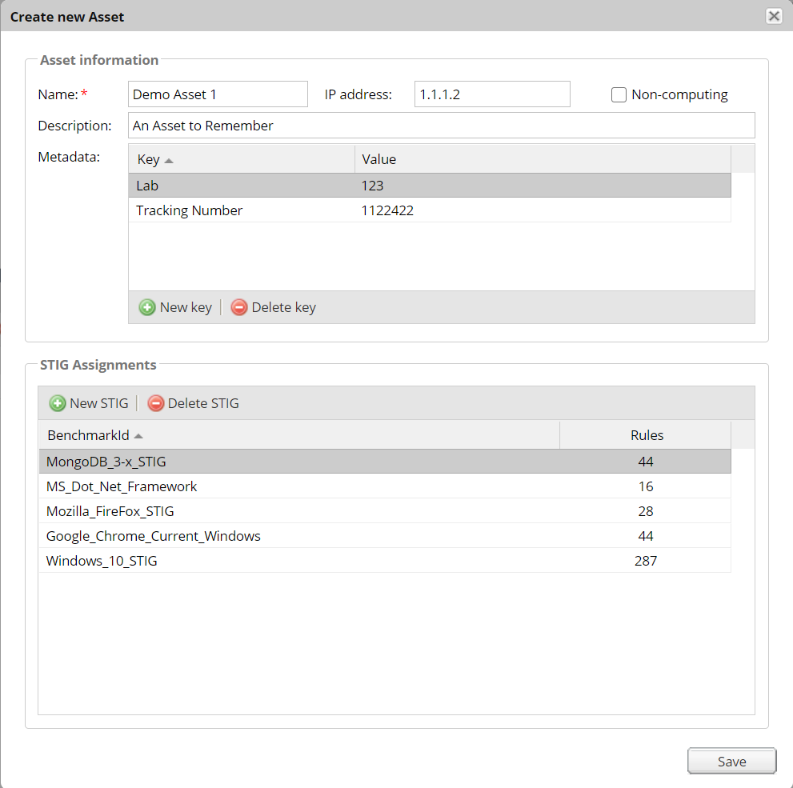
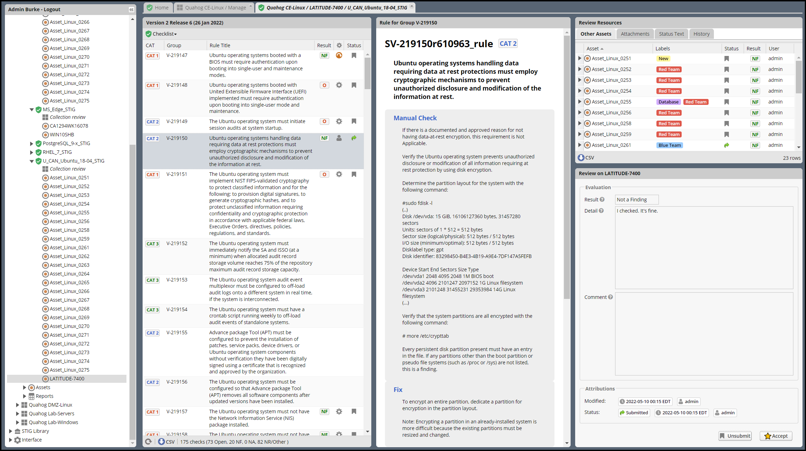

# STIG Manager QuickStart USER Guide

This QuickStart User Guide will walk you through a typical use case for STIG Manager, from creating your own Collection, creating Assets in that Collection, to evaluating STIGs and creating a POAM from your findings. Depending on your role in your organization, not all of these steps may apply to you, but should be helpful in providing context for the use of this tool. If you are comfortable, feel free to skip around using the sidebar navigation to the left.

STIG Manager's primary organizational structure is the Collection. 
Collections are composed of:
  * Assets
  * STIGs attached to those Assets
  * User Grants providing access to some or all of the Assets/STIGs in that Collection
  * Reviews

* **Collections can be structured as an RMF Package, but do not need to be.** It is recommneded that large packages be broken up into more easily-manageable Collections, to which Users can be granted higher access and, therefore, greater autonomy. 

## The Navigation Tree

The Nav Tree is located in STIG Managers leftmost panel, and provides Users access to their assigned Collections, Assets, STIGs, Reviews, and Reports. For Users with the appropriate Privileges and Grants, Administrative and Configuration functions are also available.

## Create your first Collection

* **You may have already been given access to some Collections in STIG Manager, or you may not have the Collection Creator privilege. If your Nav Tree is already sufficiently populated, feel free to skip to the Evaluate Asset STIG Compliance section.**

By default, most users will have the Collection Creator role, allowing them to create their own Collection of Assets and their STIGs, and to provide access to them to other users in the system. 

1. After logging into the system, click the _+Create Collection_ item in the Nav Tree on the left.

2. You will be prompted for your collection name, and some other info. Only a Collection name and Owner are required. (Your Username will be prepopulated as an owner, and you can add other Grants at this time.)  Click "Create" when finished. You will be taken to the Collection Configuration tab for this new Collection. You can access this Collection Configuration tab later using the "Manage" option under your Collection in the Nav Tree.
   * Mention RMF Package Workflow here

## Create Assets in your Collection

1. From the Collection Configuration tab, use the "Create Asset..." button in the Asset panel toolbar to create some sample assets. You can also attach STIGs from the "Create new Asset" popup. The only required field is "Name," which must be unique in this Collection.
   * You can change all the properties of your asset, including attached STIGs later by double-clicking an asset or using the "Change Asset properties..." button in the Assets toolbar.  
2. Assets and their STIG attachments can also be created automatically by importing STIG Viewer .ckl or XCCDF files using the "Import CKL or SCAP..." button.

## Attach STIGs to Assets in your Collection

1. Add or remove STIGs by double-clicking on an Asset in the Collection Configuration screen, and making the desired changes in the Asset Pop-up. Try to attach the same STIG to more than one Asset. It will help demonstrate the Collection Review feature later.
2. Alternately, STIGs can be attached by double-clicking on a STIG in the Collection Configuration tab. 
3. STIGs can also be attached automatically by importing STIG Viewer .ckl or XCCDF  files using the "Import CKL or SCAP..." button in the Assets panel toolbar.

* The Assets you create and the STIGs you attach to them are presented in the Collection Configuration tab (In the Asset and STIG panels on the right) as well as the Nav Tree entry for that collection on the left.

## Grant Users access to your Collection

1. Grant other Users access to your Collection by clicking the "New Grant" button in the Grants panel toolbar. Grants are composed of a Username and an Access Level.
   * When you grant Users access to your Collection, or when you are granted access to another Collection by someone else, that Collection will appear in the Nav Tree on the left upon refresh of the app.
   * The 4 Access Levels available (Restricted, Full, Manage, and Owner) provide differing levels of access to your Collection: 
  ##### User Access Levels
  | Access Level 	| Access                                                                                                                   	|
|--------------	|--------------------------------------------------------------------------------------------------------------------------	|
| Restricted   	| Can review specific STIGs on specific Assets only.                                                                       	|
| Full         	| Can review any Asset/STIG in the Collection.                                                                             	|
| Manage       	| Everything in the "Full" level. Can Add/Remove Assets, STIGs, and Users.                                              	|
| Owner        	| Everything in the "Manage" level. Can Delete the Collection.  Responsible for "Accepting" reviews from evaluators. 	|

* In order to be useful, Users with Restricted access to a Collection must be assigned specific STIGs on specific Assets using the "Restricted User access list..." button in the Grants panel toolbar.

 

## Evaluate an Asset for STIG compliance

 1. In the Nav Tree, expand Assets in the Collection you just created.
 2. Select an Asset to see its associated STIGs.
 3. Select a STIG listed under the Asset.
   * You will now be presented with the Evaluation tab for that STIG on that Asset, which contains several panels. The first Rule in the STIG will be selected for you. 
       * The **STIG Checklist panel** on the left lists every rule in the STIG, their evaluation status, and some other helpful info. Click a Rule to load that Rules information, and start a Review of it. The green highlighting indicates there is an automated check (SCAP) for that rule known to STIG Manager. It does NOT indicate that results for that rule have necessarily been imported. 
       * The **Rule Content panel** in the center contains the selected Rule's info such as the Rule Title, Manual Checks, Fix info, and associated CCIs.
       * The **Review Resources panel** in the top right contains other Reviews you have performed for the selected Rule against other assets, a history of this Review's status, and any Feedback you have received about this Review from the Collection Owner. Reviews from "Other Assets" can be dragged and dropped onto the current assets Review.
       * The **Review panel** in the lower right is where you will actually log your Evaluation of the Rule.  It contaions two sections, the Evaluation section and the Recommendation section. The Recommendation section is only active if the Evaluation Result is "Open."

 

  4. Select a few Rules and save some Evaluations of them. For now, set a few to "Open," and provide a Reccomendation Action and Comment.  You will notice that you have the option to "Save without submitting" or "Save and Submit" the Evaluations. The "Submitted" status is part of the RMF Package Workflow that you can assign your Collection, and requires certain conditions to be met. The RMF Package Workflow adds additional steps that allow a Collection Owner to Accept or Reject an Evaluators reviews. Once a review is Accepted, it is locked from additional manual changes. 
     * As you perform reviews, the STIG Checklist panel will update the status columns of each Rule. The bar at the bottom of this panel indicates overall status of the checklist. The toolbar at the top provides options for filtering the current view of the checklist, and the "Checklist" menu provides various functions, including importing results (in .ckl or XCCDF formats) and exporting results in the .ckl format.
     * These evaluations are summarized and reported in the Reports node of the Nav Tree. Findings present just the Open rule evaluations, and can be exported as a spreadsheet or a pseudo-POAM format. Status presents an overall summary of evaluations, showing completion statuses and other info. 

## Evaluate multiple Assets at once for STIG compliance

 1. In the Nav Tree, expand STIGs in the Collection you just created.
       * If you select a STIG, you will see a list of Assets that have that STIG assigned to it. Selecting one of these Assets will open the Evaluation tab described in the previous section.
 2. Expand a specific STIG, and select _Collection Review_. 
       * The Collection Review tab presents similar information to the Evaluation tab, but in a condensed view that allows you to review this STIG against all Assets you have access to in this Collection at once. 

 

 3. Select a Rule to review in the top left STIG Checklist Panel. Rule Info will appear in the panel below it.
 4. Select an Asset in the Assets panel in the top right. Double-clicking in the Result, Result Comment, Action, and Action comment columns will allow you to edit those fields, either in a pull-down or a text box, as appropriate. Results are saved automatically.
    * Columns in the STIG Checklist panel will update with Statuses and Results as you review.
 5. Once Assets are reviewed appropriately, the "Submit" or "Accept" (for Owners only) buttons in the Asset toolbar become available. Click them to set that Asset's Rule status. You can set Status on multiple Assets at once by selecting them with a Shift+Click, and then clicking the appropriate toolbar button.
 6. If you are an Owner of the Collection, you have the option to "Reject" unsatisfactory Reviews. Select a review and then type some feedback in the lower right panel to guide the Evaluator in fixing their Review. Click "Reject review with this feedback." This review will now be Unsubmitted, and show up in the Evaluators "Rejected Reviews" report for their further action or review. 
 7. If you are an Owner of the Collection, and that collection is using the RMF Package Workflow, you can set Reviews in your Collection to "Accepted." Accepting a Review locks it from further modification by non-Owners.  

## STIG Manager Reports

### Findings Report
 1. In the Nav Tree, expand Reports in the Collection you just created.
 2. Click the Findings report.
    * This report lists every Open review in the Collection. It can be aggregated by Rule, Group, or CCI, and filtered by STIG.
    * From the bottom bar of the Aggregated Findings panel, a .csv and a POAM-like export is available for the Rule and Group aggregations.
 3. Select a Finding in the Aggregated Findings panel on the left to display the Assets with those findings in the Individual Findings Panel on the right. 
 4. Click the "Generate POA&M..." button in the bottom bar of the Aggregated Findings panel.
    * You will be prompted for a little more information, which will be prepopulated into the POA&M that will be generated for you.

 

### Status Report
 1. Click the Status report in the Nav Tree.
    * The Status report provides information about the progress of STIG Evaluations. By default it will list each Asset, and their attached STIGs. 
 2. Click the shield icon in the Grouping box in the top left of the Status report. 
    * The Status report will pivot to list each STIG that is a part of this Collection, and each Asset that has that STIG attached to it.
 3. Click the down arrow in bottom toolbar to export this Status report as a .csv.

 

 
  

#### Congratulations! You've just Managed some STIGs!

